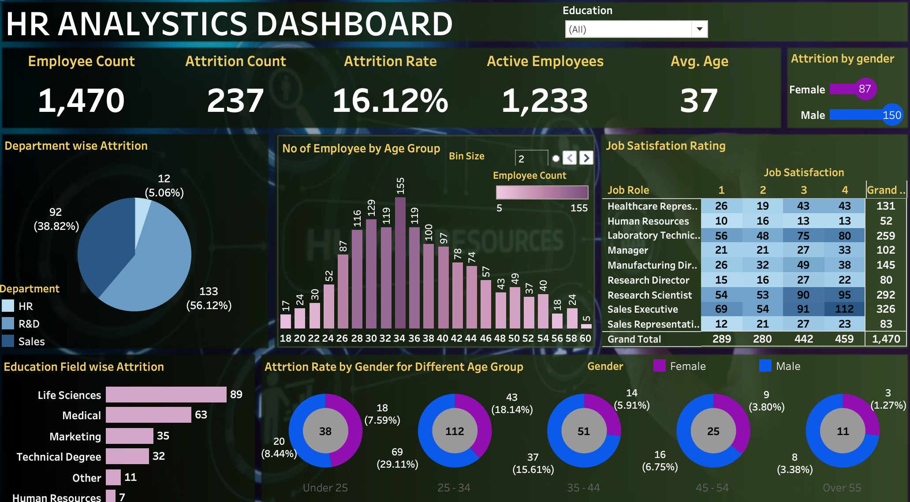

 HR Analytics Dashboard

## Project Overview
This project is an interactive HR Analytics Dashboard created using Tableau. The dashboard provides insights into employee attrition, workforce distribution, salary analysis, and department performance.

## Tools Used
- Tableau
- Excel

## Key KPIs
- Employee Count
- Attrition Rate
- Average Salary
- Department-wise Analysis

## Key Insights
- Highest attrition observed in Sales department
- Employees aged 25–34 showed higher turnover
- Average salary varied significantly across job roles

## Dashboard Features
- Employee Attrition Analysis
- Department-wise Performance
- Salary Distribution
- Workforce Demographics
- Interactive Filters & KPIs

## Live Dashboard
[View Dashboard](https://public.tableau.com/app/profile/kailash.suthar/viz/HRAnalyticsDashboard_17784236935850/HRAnalyticsDashboard)

## Dashboard Preview

